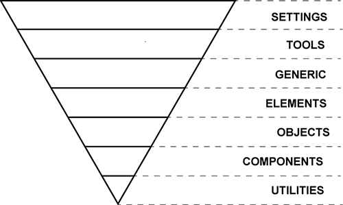

# ▽ ITCSS Sample

A simple ITCSS folder structure sample.

## What is ITCSS?

> ITCSS stands for _Inverted Triangle CSS_ and it helps you to organize your project CSS files in such way that you can better **deal with** (not always easy-to-deal with) CSS specifics like **global namespace, cascade and selectors specificity**.
>
> — Lubos Kmetko, in [ITCSS: Scalable and Maintainable CSS Architecture](https://www.xfive.co/blog/itcss-scalable-maintainable-css-architecture/)

It was created by [Harry Roberts](https://csswizardry.com/) and it works very well with methodologies like [BEM](https://en.bem.info/methodology/css/), [SMACSS](https://smacss.com/) or [OOCSS](https://github.com/stubbornella/oocss/wiki).

Check out [INUITCSS](https://github.com/inuitcss/inuitcss) to see the best example of ITCSS.

&nbsp;

&nbsp;

## Learn more about ITCSS

* [📄 Manage large CSS projects with ITCSS](https://www.creativebloq.com/web-design/manage-large-css-projects-itcss-101517528), Harry Roberts - Creative Bloq
* [📺 Managing CSS Projects with ITCSS](https://youtu.be/1OKZOV-iLj4), Harry Roberts - YouTube
* [:octocat: INUITCSS Project](https://github.com/inuitcss/inuitcss), Harry Roberts - GitHub
